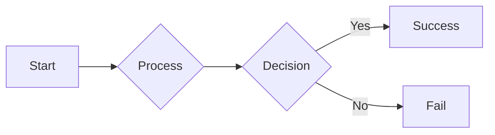

This is a test.

Here is some math: 

$$x = \frac{-b \pm \sqrt{b^2 - 4ac}}{2a}$$

Here is a flow chart:

```mermaid
flowchart LR
    A[Start] --> B{Process}
    B --> C{Decision}
    C -- Yes --> D[Success]
    C -- No --> E[Fail]
```
